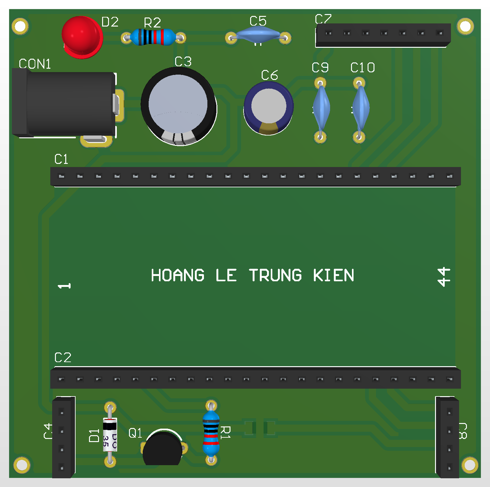

# PayVoice Box (Main Control Unit)

A central control board designed for voice payment applications.

## Function
Bridges the main MCU with audio and HMI peripherals.

## Key Specifications
- Audio: I2S (LRC, BCLK, DIN)
- HMI: LCD + navigation buttons
- MCU: Daughter-board headers
- Alert: Buzzer driver (S8050)

## Hardware Preview

---
Designed by HOANG LE TRUNG KIEN
